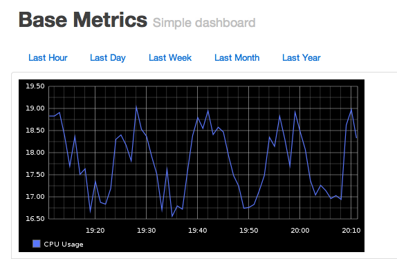

<!SLIDE subsection>
# gdash resources

<!SLIDE code small>
# gdash_dashboard

    @@@ Ruby
    def initialize(*args)
      super
      @action = :create
    end

    actions :create, :delete

    attribute :category, :kind_of => String, :required => true
    attribute :description, :kind_of => String, :required => true
    attribute :display_name, :kind_of => String, :required => false

<!SLIDE code smaller>
# gdash_dashboard_component

    @@@ Ruby
    def initialize(*args)
      super
      @action = :create
    end

    actions :create, :delete

    attribute :lines, :kind_of => Array, :required => false

    %w(forecasts fields).each do |attr_hash|
      attribute attr_hash, :kind_of => Hash, :required => false
    end

    %w(dashboard_name dashboard_category).each do |attr_string_req|
      attribute attr_string_req, :kind_of => String, :required => true
    end

    hash_attrs = %w(warning critical)
    hash_attrs.each do |attr_hash|
      attribute attr_hash, :kind_of => String, :required => false
    end
    
    ... "There's more clever stuff, go check out the code!"

<!SLIDE subsection>
# making a dashboard

<!SLIDE code >

    @@@ Ruby
    gdash_dashboard 'Base Metrics' do
        category 'Basic'
        description 'Simple Dashboard'
    end
    
    gdash_dashboard_component 'cpu' do
        dashboard_name 'Base Metrics'
        dashboard_category 'Basic'
        fields(
          :cpu => {
            :data => '*.*.*.cpuUsage',
          }
        )

<!SLIDE center>

