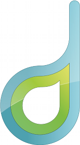
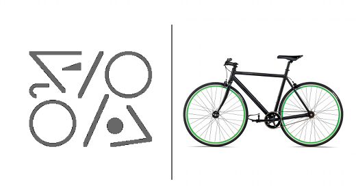
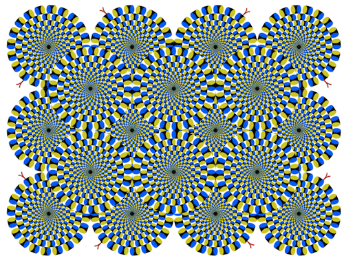
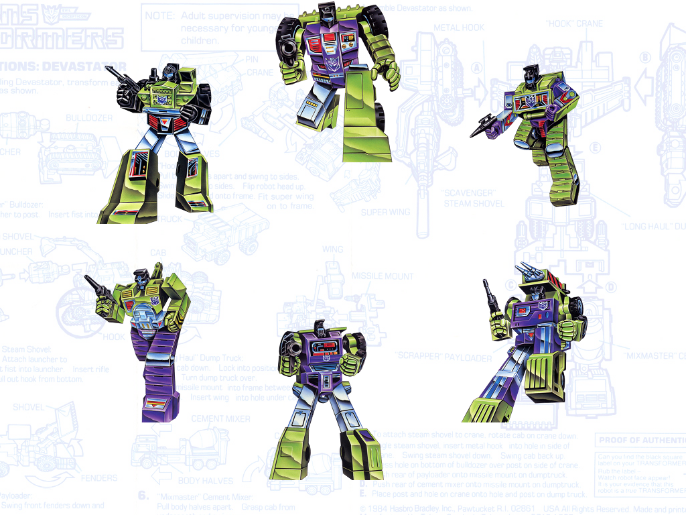
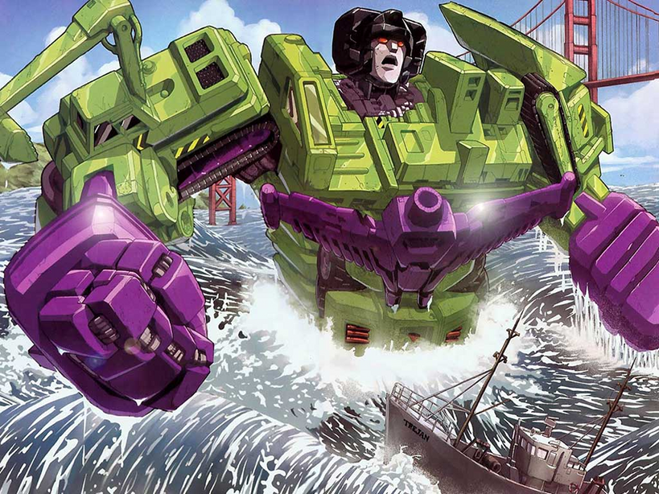

<!SLIDE center>
# A Gestalt Informant
 
 

## Heavy Water Software
### #ChefConf 2012

<!SLIDE bullets incremental transition=scrollUp>
# ge·stalt : 
##  [guh-shtahlt, -shtawlt, -stahlt, -stawlt]

* a configuration ... having specific properties that cannot be derived from the summation of its parts; a unified whole.

* an instance or example of such a unified whole.

<!SLIDE center bullets incremental transition=growX>

* in art:
* 
* the unified whole is different from the sum of the parts

<!SLIDE center bullets incremental transition=growX>
* in psychology:
* 
* brain is self-organizing
* perception is a product of complex interactions among various stimuli

<!SLIDE center transition=curtainX>

<!SLIDE smaller center bullets incremental transition=fadeZoom>

* Transformers &#169;Hasbro, Thanks. {◕ ◡ ◕}
