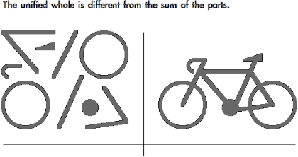
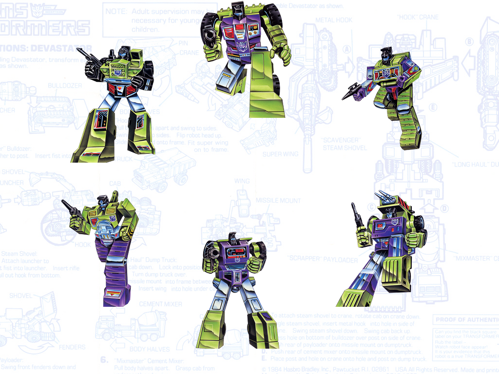

<!SLIDE center>
# A Gestalt Informant #

## Heavy Water Software ##
### #ChefConf 2012 ###

<!SLIDE bullets incremental transition=scrollUp>
# ge·stalt : #
##  [guh-shtahlt, -shtawlt, -stahlt, -stawlt] ##

* a configuration ... having specific properties that cannot be derived from the summation of its parts; a unified whole.

* an instance or example of such a unified whole.

.notes first, maybe a definition is in order. who's heard of the term "gestalt"?

<!SLIDE center incremental transition=growX>

* In art:

* In psychology:
* Brain possesses self-organizing tendencies
* Perception is the product of complex interactions among various
  stimuli

.notes used in both art and psychology, wish I could say that was my inspiration

<!SLIDE center transition=curtainX>

.notes I got it from Transformers. all these little guys would combine

<!SLIDE smaller center incremental transition=fadeZoom>

* Transformers &#169;Hasbro, Thanks. {◕ ◡ ◕}

<!SLIDE center incremental>
# Monitoring is Important #
##[duh]##

* You can't manage what you haven't measured

.notes I actually heard this phrase from an acquaintance who does
building assessments to project long term maintenance costs. If it
applies in the case of physical buildings, how much more so in our
field where assets can often seem much less tangible.

<!SLIDE center incremental>
# Monitoring is hard #

* Just because it's up doesn't mean it's working

<!SLIDE center incremental>
# Distributed systems are complex #

* Failures often a result of a confluence of events, no single root cause

.notes and other reasons
